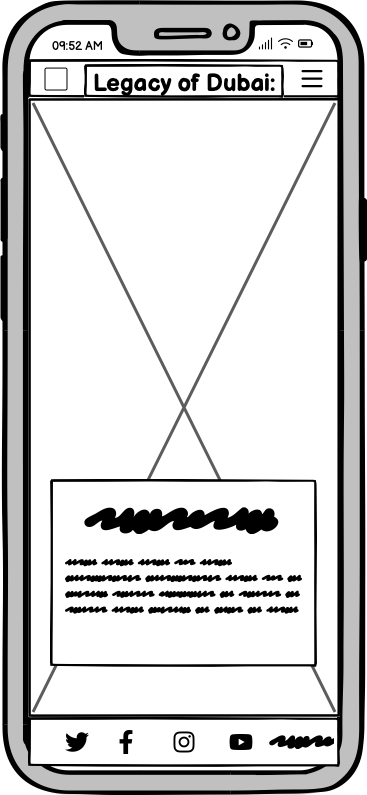
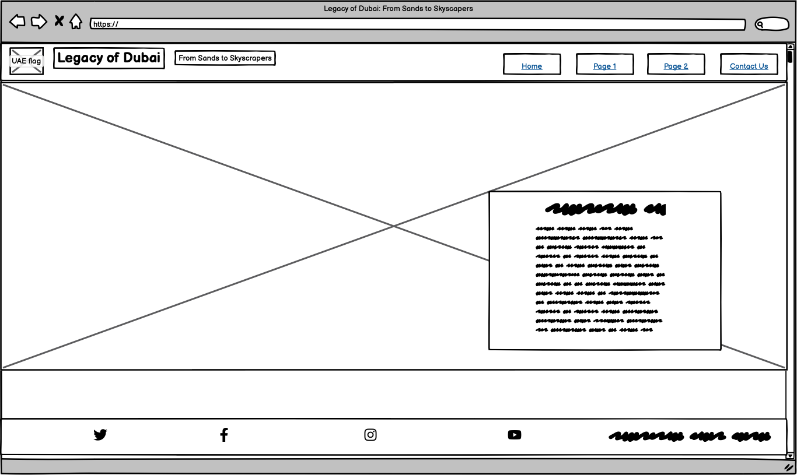

<h1 id="page-top"> Legacy of Dubai: From Sands to Skyscrapers</h1>

## Introduction 

**Legacy of Dubai** is a website which goes into depth on the history of Dubai, from its beginnings as a desert Emirate into the luxurious, glamorous Emirate we know of today. The site is targetted towards people who want to learn more about Dubai and its rich history, especially those who are planning to visit Dubai or have already done so. **Legacy of Dubai** will be a useful site for tourists and non-tourists alike who take great interest in Middle Eastern history and culture.

    <a href="https://mariam138.github.io/legacy-of-dubai/">Visit the live site here!</a>
    
## User Stories

- As a user I want to find out about the history of Dubai
- As a user I want to know how the discovery of oil impacted Dubai's development
- As a user I want to be able to contact someone easily with some more questions about Dubai for my own travels
- As the organisation we want to highlight the history of Dubai to all users
- As the orgaaisation we want to promote our social media channels

## Design

### Typography

The header fonts have been set to **Montserrat** for a clean but slightly regal look. As it is a part of the sans serif family, it also allows accessibility for those with visual impairments. I used [fontjoy.com](fontjoy.com) to help pair a similar font to **Montserrat** to be used for the body of the text. The font that was generated was **Mukta**, keeping the theme cohesive, but allowing the pages to still be clean and readable.

### Colour Scheme

I wanted the colour scheme of the website to reflect the colours of the desert, as it is what I most commonly associate Dubai and the Middle East with. I first went onto use [Adobe's colour generator](https://color.adobe.com/explore) and searched for colour schemes based on the search term "Dubai". I found a colour scheme generated from a picture of the Dubai skyline at sunset with the desert in the foreground. From there, I chose the chocolate brown colour (Hex code: #73351F) to be the main colour.

I then used [ColorSpace](https://mycolor.space/) to generate a colour scheme using the chocolate brown colour as the main colour. I decided upon this colour scheme which includes a lighter brown colour, a beige-cream colour and a blue as an accent colour.

To make sure these colours would be accessible to those who are visually impaired, I used [EightShapes' contrast grid](https://contrast-grid.eightshapes.com/). The brown and beige colours can be used interchangeable along with white and black. However the blue accent colour (Hex code #00B2FF) only passes the contrast test with Black, so for this I have decided to use it only as an accent colour with buttons for example. 
The lighter brown colour (Hex code #AB654C) however does not pass with the other colours, and only recieves a AA pass when used with black. So I decided to not use this colour throughout my project.

### Wireframes

Initially I had made simple wireframe structures using **Balsamiq** for the home page on dekstop and mobile. I have since made some slight changes to the deployed website, mainly with the hero cover text and its positioning.

## Features

### Common Features

#### Navigation Bar

The first common feature of the website is the navigation bar. The navigation bar keeps the same style across all pages of the website (including the hidden pages) and keeps the logo on the left hand side.

On mobile phones, a menu icon is placed on the right hand side, and when clicked upon, a drop down menu appears underneath with the links showing in a column.

On larger screens, the menu icon is gotten rid of in favour of having the links display in a row on the right hand side of the header.

The **Contact Us** link has been styled as a button on all screen sizes to indicate that this page does not follow the flow of the main content.

The navigation links are underlined as a visual clue to the user to highlight which page they are currently on.

On laptop screens and larger, the **Page 1 and Page 2** links show an underline when theyuser hovers on them to indicate that they are cliackable. For the **Contact Us** button, the button changes into a blue colour with black text when hovered upon, again to show it is clickable, but also that it will lead to a page which is not part of the main content.

#### Footer

The footer, like the navigation bar, also remains the same on all pages of the website. The footer includes 3 links to social networking sites: Facebook, Twitter/X and Instagram. Underneath the links there is copyright text.

On laptop and desktop screens, hovering over the links will produce an underline. Again, this is to indicate that the links are clickable.

## Other Features

### Home Page

The home page has a hero image of the Burj Khalifa at night time, one  of Dubai's most famous landmarks and also the tallest building in the world. I wanted to use this as the main hero image due to its recognisability and association with Dubai.

There is also overlay text which reinforces the website's name, and also provides a tagline of *"From Sands to Skyscrapers"*. The same tagline is in the website's title, so that it shows in the tab on the web browser. This tagline summarises the history of Dubai but adds some drama. <!--reword this please).--> The overlay text is centered on mobile phones, but on larger screens it is placed in the top-right corner as to not cover the background image of the Burj Khalifa.

Introduction text underneath the hero image helps give a clear understanding about what the site is about.

### Origins Page 

The origins page starts off the first half of the journey on the website through Dubai's history. It provides a detailed account of Dubai's history from it's earliest record until the discovery of oil in 1966. The page is split into sections which group specific time periods together.

### Modern Day Page

The modern day page goes into depth about the development of Dubai after the discovery of oil, right until modern day. A video is embedded which is a 5 minute visual summary of the development of Dubai, dating when all the landmarks and areas of Dubai were built and developed.

### Contact Form Page

The contact form page has a different hero image this time, one of the Burj al Arab, another famous landmark of Dubai.

The contact form has been placed over the image but given some transparency to allow the picture of the Burj al Arab to still show through behind.

The contact form allows the user to send any questions/queries they might have, or simply just some feedback to improve the site. The contact form requires both a First and Last name, an e-mail address and a message. There is an optional radio button section which allows the user to enter whether they have visited Dubai before or not.

### Hidden Pages

There are two hidden pages on the website. The first is a thank you page, which loads after submitting the form.

The second page is a 404 page. I have styled my own 404 page rather than rely on the one provided by GitHub. This page will load if an incorrect address is typed into the address bar.

### Future Features

- In the future, I would like to add another page which discusses Dubai's future goals and projects, as they are constantly evolving and changing. For example, a new high-speed train is being developed, which will run between all 7 emirates and be the first to do so.
- Another feature would be to implement a gallery page with photos of the famous landmarks in Dubai, or before/now pictures.

## Testing

### Validation of Code

Before checking the validation of the code on the deployed website, I checked the validity of the HTML and CSS frommy workspace using the [W3C Validator](https://validator.w3.org/) for any errors. Initially, for the **Contact Us** button, my html code was written so that the **button** element was wrapped in an anchor tag, and styling the button itself using css. When I ran the code through the validator, this showed up as an error saying that the button element must not be a descendant of the anchor tag. I found a blogpost on [sentry.io](https://sentry.io/answers/how-do-i-create-an-html-button-that-acts-like-a-link/) that explains that this is because of an accessibility issue. Instead, I left it as a link and used CSS to style it as a button, using the suggestion from the blogpost. When running through the vaiidator, this did not bring up any errors.

Using the W3C HTML validatr, no errors were shown after validating each page on the website.
- [index.html](https://validator.w3.org/nu/?doc=https%3A%2F%2Fmariam138.github.io%2Flegacy-of-dubai%2F)
- [origins.html](https://validator.w3.org/nu/?doc=https%3A%2F%2Fmariam138.github.io%2Flegacy-of-dubai%2Forigins.html)
- [modern-day.html](https://validator.w3.org/nu/?doc=https%3A%2F%2Fmariam138.github.io%2Flegacy-of-dubai%2Fmodern-day.html)
- [contact-form.html](https://validator.w3.org/nu/?doc=https%3A%2F%2Fmariam138.github.io%2Flegacy-of-dubai%2Fcontact-form.html)
- [thank-you.html](https://validator.w3.org/nu/?doc=https%3A%2F%2Fmariam138.github.io%2Flegacy-of-dubai%2Fthank-you.html)
- [404.html](https://validator.w3.org/nu/?doc=https%3A%2F%2Fmariam138.github.io%2Flegacy-of-dubai%2F404.html)

Using the Jigsaw CSS validator, no errors were found in the CSS for the website.

### Accessibility Testing

The accesibility of the website was validated using [Wave](wave.webaim.org). One error came up on the deployed site initially,where my message input on the contact form had an empty label. I entered in a label and used the sr-only class in my CSS to visually hide the label but still be present for screenreaders. Upon checking again, no error was seen on the contact form page. No other errors were shown on the other pages of the website.

### Lighthouse

I used Lighthouse on Chrome's DevTools to test the website's performance on both Mobile and Desktop.

- The initial report for mobile gave a performance score of 62 which was due to the size of the front page's hero image. After reducing the image size and optimising it for mobile, I ran the report again. No issues were raised after this change.

- For the desktop, no issues were raised by the performance test.

### Manual Testing

Manual testing was done on several devices: 
- Desktop:
- Laptop: MacBook Air 13"
- Tablet: iPad Mini 3
- Phone: iPhone 13
- Android: Chrome DevTools

Testing was conducted on the following browsers:
- Google Chrome
- Safari

#### Common Features Testing

Each of the common features were tested on every page.

##### Navigation Bar
| Feature being tested              | Expected Outcome                         | Testing Performed                  | Actual Outcome                                                       | Result |
| --------------------------------- | ---------------------------------------- | ---------------------------------- | -------------------------------------------------------------------- | ------ |
| Legacy of Dubai logo              | Reload index.html                        | Click logo                         | Reloads index.htlm                                                   | Pass   |
| Menu icon (phone and tablet only) | Loads navigation links underneath        | Clicked menu icon                  | Loads navigation links underneath nav bar                            | Pass   |
| Origins link                      | Open origins.html                        | Click on Origins link in navbar    | Loads origins.html                                                   | Pass   |
| Origins link:hover                | Text shows underline                     | Hover mouse over origins link      | Underline appears when hovering mouse                                | Pass   |
| Modern Day link                   | Opens modern-day.html                    | Click link                         | Opens modern-day.html                                                | Pass   |
| Modern Day link: hover            | Text shows underline                     | Hover mouse over origins link      | Underline appears when hovering mouse                                | Pass   |
| Contact Us link                   | Opens contact-form.html                  | Click link                         | Opens contact-form.html                                              | Pass   |
| Contact Us link:hover             | Button changes to blue and black colours | Hover mouse over contact us button | Colours change to blue background and black text when hovering mouse | Pass   |

##### Home Page Hero Image

| Feature being tested                        | Expected Outcome                                       | Testing Performed                                 | Actual Outcome                                          | Result |
| ------------------------------------------- | ------------------------------------------------------ | ------------------------------------------------- | ------------------------------------------------------- | ------ |
| Background image                            | Background image loads                                 | Open index.html                                   | Picture loads                                           | Pass   |
| Background image                            | Image covers screen at all widths                      | Use DevTools to stretch through all screen widths | The image covers the screen at all widths               | Pass   |
| Hero cover text (mobile phones and tablets) | Text is centred                                        | Loaded index.html                                 | Hero cover text is central on mobile and tablet screens | Pass   |
| Hero cover text (laptops and desktops)      | Text moves to top right corner to not cover hero image | Open index.html                                   | Hero cover text shows in top-right corner               | Pass   |

##### Footer

| Feature being tested                      | Expected Outcome                            | Testing Performed                     | Actual Outcome                                                | Result |
| ----------------------------------------- | ------------------------------------------- | ------------------------------------- | ------------------------------------------------------------- | ------ |
| Facebook icon                             | Opens facebook.com in new tab               | Click link                            | Facebook.com opens in new tab                                 | Pass   |
| X icon                                    | Opens x.com in new tab                      | Click link                            | Twitter.com opens in new tab                                  | Pass   |
| Instagram icon                            | Opens instagram.com in new tab              | Click link                            | Instagram.com opens in new tab                                | Pass   |
| Social media icons (laptops and desktops) | Shows underline when mouse hovers over them | Hover mouse over each individual link | All links show with underline when mouse is hovered over them | Pass   |

#### Page-specific Features Testing

Each page then had its own manual testing for the page-specific features.

##### Origins Page

| Feature being tested                                   | Expected Outcome                                       | Testing Performed     | Actual Outcome                                                | Result |
| ------------------------------------------------------ | ------------------------------------------------------ | --------------------- | ------------------------------------------------------------- | ------ |
| Images                                                 | All images load                                        | Click on origins.html | All pictures load on page                                     | Pass   |
| Images                                                 | Images change width depending on screen size           | DevTools              | All images are responsive on all screen sizes                 | Pass   |
| Trucial States Flag image (tablets and laptop screens) | Image moves to left of screen and text wraps around it | Load origins.html     | Flag image is aligned left on screen and text wraps around it | Pass   |

##### Modern Day Page

| Feature being tested                                  | Expected Outcome                                      | Testing Performed                     | Actual Outcome                                         | Result |
| ----------------------------------------------------- | ----------------------------------------------------- | ------------------------------------- | ------------------------------------------------------ | ------ |
| Images                                                | All images load                                       | Open modern-day.html                  | All pictures load                                      | Pass   |
| Images                                                | Images change width depending on screen size          | DevTools                              | All images are responsive on all screen sizes          | Pass   |
| Newspaper clipping image (laptop and desktop screens) | Image moves to right of page and text wraps around it | Open modern-day.html                  | Newspaper image aligned right and text wraps around it | Pass   |
| Youtube video                                         | Youtube video plays when clicked                      | Click on play button on youtube video | Youtube video starts playing                           | Pass   |
| Youtube video                                         | Embedded video changes size depending on screen size  | DevTools                              | Youtube video is responsive on all screen sizes        | Pass   |

##### Contact Us Page

| Feature being tested                       | Expected Outcome                                        | Testing Performed                               | Actual Outcome                                                                          | Result |
| ------------------------------------------ | ------------------------------------------------------- | ----------------------------------------------- | --------------------------------------------------------------------------------------- | ------ |
| Hero image                                 | Image loads                                             | Load contact-form.html                          | Background image is loaded and covers entire screen                                     | Pass   |
| Hero image                                 | Image covers screen on all devices                      | Use DevTools to check responsiveness            | Image covers screen on all screen sizes                                                 | Pass   |
| Form                                       | Form will not submit without filling in required fields | Press the submit button without filling in form | Each input shows a message saying that the input is required before submitting the form | Pass   |
| Form radio buttons                         | Only one radio button can be selected at any time       | Click each radio button                         | Only one radio button is selected at a time when each one is clicked                    | Pass   |
| Submit button                              | Leads to thank you page                                 | Click submit button after filling out form      | Loads the thank you page                                                                | Pass   |
| Submit button:hover (laptops and desktops) | Changes colours to a light button scheme                | Hover mouse over submit button                  | Colours change to a light background and dark brown text                                | Pass   |
| Clear button                               | Clears any filled in information on form                | Press clear button                              | All information is deleted and form is blank                                            | Pass   |
| Clear button:hover (laptops and desktops)  | Changes colours to a blue background and black text     | Hover mouse over clear button                   | Colours change to blue background and black text                                        | Pass   |

##### Thank You Page

| Feature being tested                     | Expected Outcome                  | Testing Performed            | Actual Outcome                                         | Result |
| ---------------------------------------- | --------------------------------- | ---------------------------- | ------------------------------------------------------ | ------ |
| Main text                                | Shows when screen is loaded       | Load thank-you.html          | Text shows when page is loaded                         | Pass   |
| Home button                              | Loads index.html when clicked     | Click on home button         | Index.html is loaded when button is clicked            | Pass   |
| Home button:hover (laptops and desktops) | Changes into light scheme colours | Hover mouse over Home button | Colours change to light background and dark brown text | Pass   |

##### 404 Error Page

| Feature being tested                     | Expected Outcome                             | Testing Performed                       | Actual Outcome                                         | Result |
| ---------------------------------------- | -------------------------------------------- | --------------------------------------- | ------------------------------------------------------ | ------ |
| 404 page                                 | 404.html loads when incorrect url is entered | Enter in incorrect URL into address bar | Loads 404.html page                                    | Pass   |
| Main text                                | Shows when screen is loaded                  | Load 404.html page                      | Text shows when page is loaded                         | Pass   |
| Home button                              | Loads index.html when clicked                | Click on Home button                    | Index.html page loads                                  | Pass   |
| Home button:hover (laptops and desktops) | Changes into light scheme colours            | Hover over Home button                  | Colours change to light background and dark brown text | Pass   |

### Bug Fixes

1. Upon initial deployment onto github pages, none of the CSS styling appeared to be showing, despite showing on thge local server. When checking the code for the link to the CSS style sheet in the HTML index page, the file paths appeared to start with a forward slash (/), making them absolute file paths rather than relative file paths. Removing the forward slash fixed the problem, allowing the CSS  styling to show on the deployed webpage.

2. After styling the hero image for the home screen, I checked to see whether it was responsive for all screen sizes. Viewing the home page on my laptop screen showed there to be some whitespace on the right of the page, leading to a horizontal scroll bar. This would lead to a bad user experience.

    To fix this, I used the **overflow-x** property to hide the horizontal scroll bar. This helped to get ride of the white space on the screen.
    

3. When inserting images into the main content, I tried to use the picture tag so that I could use media queries to have different resolutions of the same picture show at different screen sizes. But when checking on both Dev tools and on the deployed website, this didn't seem to work, and would only show the smallest resolution image.

    
    

    I tried running the code through the W3C HTML validator to check for any errors, in which it didn't bring up any. Googling for an answer also came to no avail. I used the tutor service to see if they could help with my code as a final resort. The tutor checked my media queries using a different image which seemed to work, but would not work on the images I wanted to use. Unfortunately, the tutor could also not figure out the problem. So I had to resort back to using the img tag instead and using the media queries in my CSS stylesheet.

4. When embedding a youtube video into the post-oil.html page, the youtube video would not load and a broken link would show.
   
   Instead of copying the url directly into the src attribute tag for the iframe, I copied and pasted the embed tag that youtube itself gives for the video. There may also have been a missing > at the end of my iframe tag which is why the video may not have worked. This solved the issue and the youtube video was able to load.

5. On larger screens, the background picture of the Burj Al Arab on the contact form page would show a gap underneath, rather than covering the full screen. This turned out to be because I had set the height on the image to 700px. To fix this, I changed the height to 100vh instead, and also added the property background-attachment and made it fixed. This is so that when scrolling on larger screens, if the height of the image was less than the screen the gap would not show when scrolling.

6. For the contact form, I used a **textarea** element for the "Your message" part of the form. I set the width and height using the **cols** and **rows** attributes in the html tag. On larger screens, this was fine. But on smaller screens, such as on mobile screens, the text area would overflow over the actual contact form itself.  By setting the width of the text area to 100%, this allowed it to stay within the contact form divider at all screen sizes.

    

## Deployment

The site was deployed onto GitHub pages near the start of the project. The steps to deploy are as follows:
 1. On the repository page for the project on GitHub, click on **Settings**
 2. On the left hand side of the pape, click the **Pages** link
 3. Under the **Branch** sub-heading, select **main** as the branch and click save
 4. Once selected, navigate back to the **Code** tab at the top
 5. Wait for a few minutes before refreshing the page to view the deployed site

## Credits

### Content 

The information on the history of Dubai has been adapted from several sources.

#### Websites:
- [Visit Dubai](https://www.visitdubai.com/en/articles/history-of-dubai)
- [Britannica](https://www.britannica.com/place/Dubai-emirate-United-Arab-Emirates)
- [Amazing Dubai](https://www.amazing-dubai.com/history-of-dubai.html)
- [Dubai.com](https://www.dubai.com/v/history/)

#### Books

- **Keepers of the Golden Shore: A History of the United Arab Emirates** by *Michael Quentin Morton* (2016)

### Media

- The Burj Al Arab favicon is by [Icons8](<https://icons8.com/icon/RnOkEfOBUH9P/burj-al-arab>)
- The Burj Khalifa and Burj al Arab hero images are from [pxhere](https://pxhere.com/)
- The Dubai Creek image on the *Origins* page is from [MonoVisions](https://monovisions.com/vintage-pre-oil-era-in-dubai-1960s/)
- The image of the Trucial States flag is from [ozoutback.com](https://ozoutback.com.au/the%20United%20Arab%20Emirates/flags/slides/05_trucialcoast.html)
- The image of Sheikh Rashid discovering oil is from [dubaiasitusedtobe.net](https://dubaiasitusedtobe.net/SheikhRashidsOil1966.shtml)
- The newspaper image on the *Modern Day* page is from the [Arabian Gulf Digital Archive](https://www.agda.ae/en/folder/50-years-formation-united-arab-emirates)
- The picture of the first Emirates flight is from [Gulf News](https://gulfnews.com/today-history/october-25-1985-emirates-makes-a-good-start-1.1606067)
- The video of Dubai's development is from [Knight Frank on Youtube](https://youtu.be/voN9imXg6xM)
- All icons used are from [Font Awesome](https://fontawesome.com/)
- Fonts have been imported from [Google Fonts](https://fonts.google.com/)

### Code

#### Code Institute

- The code to create a sticky header and push the footer to the bottom has been adapated from the [Love Running project](https://learn.codeinstitute.net/courses/course-v1:CodeInstitute+LRFX101+2023_Q2/courseware/e805068059af42af87681032aa64053f/7525117e5cd144daa2a7b0c57843bbee/)
- The code to create the dropdown toggle for mobile navigation has been adapted from the [Love Running project](https://learn.codeinstitute.net/courses/course-v1:CodeInstitute+LRFX101+2023_Q2/courseware/e805068059af42af87681032aa64053f/7525117e5cd144daa2a7b0c57843bbee/)

#### Other Sources

- The template code to insert the favicon is from [W3S Schools](https://www.w3schools.com/html/html_favicon.asp)
- The code to make the toggle on the mobile navbar accesssible is adapted from [css-tricks](https://css-tricks.com/inclusively-hidden/)
- The code to horizontally centre a div element when the position is set to absolute is adapted from [CodeDamn.com](codedamn.com/news/frontend/horizontal-alignment-in-css)
- The code to allow images to be responsive but never exceed full width is adapted from [W3Schools](www.w3schools.com/css/css3_images.asp)
- The code to make the youtube video responsive is adapted from [Avex Designs](www.avexdesigns.com/blog/responsive-youtube-embed)
- The use of the clamp attribute with the youtube video has been adapted from [Geeks for Geeks](www.geeksforgeeks.org/css-clamp-method)
  
  All other code and text was created by myself.

  <a href="#page-top" style="font-size: 20px; color: black;">Back to the top</a>
